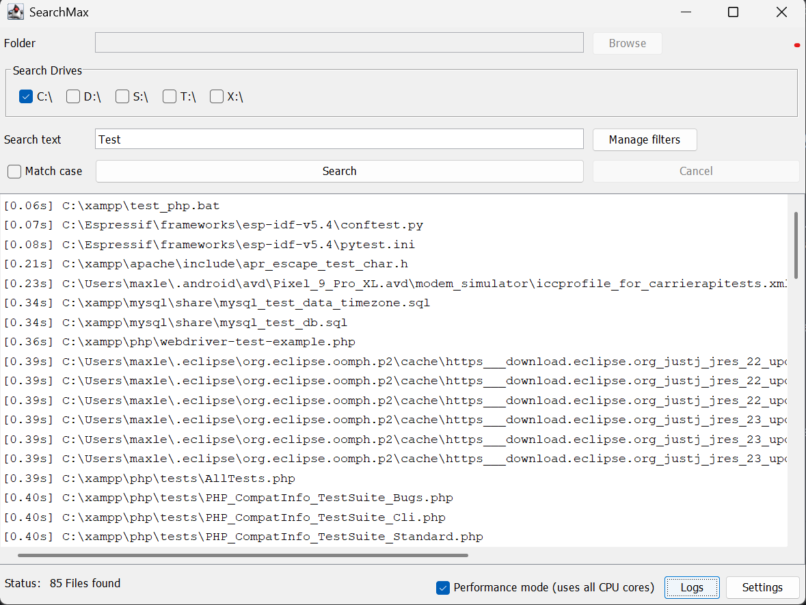
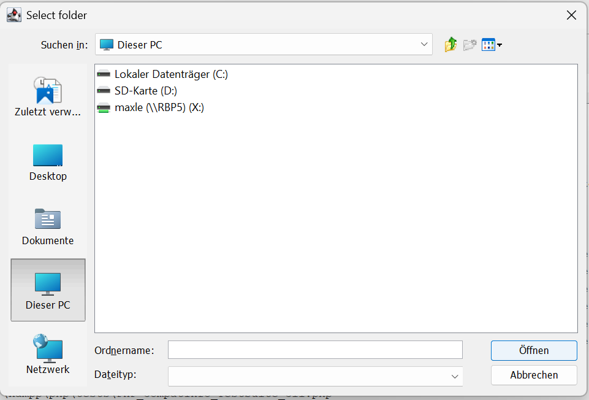
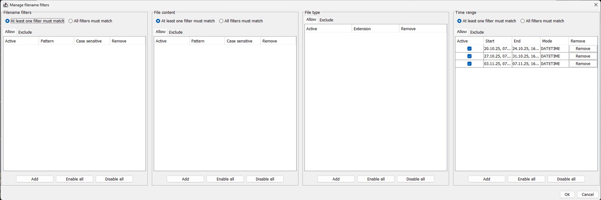
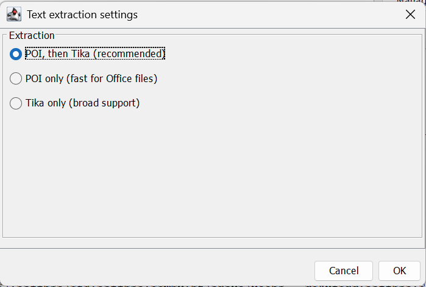

# SearchMax

SearchMax is a desktop application for fast, flexible file discovery and optional file extraction. It provides filtering
by filename, file content, and file extensions, along with tools for exporting or copying matched results.

---

## Overview

SearchMax helps power users, developers, and administrators locate files quickly across multiple directories or drives.
Searches can be refined using filename patterns, content-based filters, and extension allow/deny lists. If desired,
matched files can be copied or exported using customizable extraction rules.

The interface is structured into drive selection, filtering controls, extraction settings, and a results panel for
efficient workflow.

---

## Key Features

* Clear and responsive GUI with search input, progress display, and results table.
* Search across multiple drives and folders simultaneously.
* Filename and content filters:

    * Wildcard and pattern-based filename matching.
    * Include/exclude rules for file content or names.
* Extension allow/deny lists for targeted or restricted searches.
* Cancellable and non-blocking search process with live progress updates.
* Results table with batch operations (open folder, copy path, export selected files).

---

## Screenshots

* Main window
  

* Drive selection panel
  

* Filter and extension configuration dialog
  

* Extraction settings dialog
  

---

### Drive Selection

Choose one or more drives or directories to include in the search. If access to a location is restricted, the
application logs a warning and continues with allowed paths.

### Search Criteria & Filters

Enter filename patterns or keywords. Add include/exclude filters for content or filenames. Enable or disable filters
individually to test different configurations.

### Extension Allow/Deny Lists

Specify which file types to include or exclude. Useful for narrowing searches to text files or ignoring large binary
formats.

### Running a Search & Monitoring Progress

Searching runs in the background. The status panel shows the current file, processed counts, and elapsed time. The
search can be cancelled at any time.

### Results & Available Actions

Search results appear in a sortable table. You can:

* Open file locations
* Copy paths to clipboard
* Extract selected files (if enabled)
  Just download the latest jar:

<table style="width:100%">
  <tr>
    <th>Version</th>
    <th>Download</th>
    <th>Release Type</th>
  </tr>
 <tr>
    <td>v1.0.1</td>
    <td><a href="jar/SearchMax-1.0.1.jar">SearchMax v1.0.1</a></td>
    <td>Stable</td>
  </tr>
 <tr>
    <td>v1.0.0</td>
    <td><a href="jar/SearchMax-1.0.0.jar">SearchMax v1.0.0</a></td>
    <td>Stable</td>
  </tr>
</table>